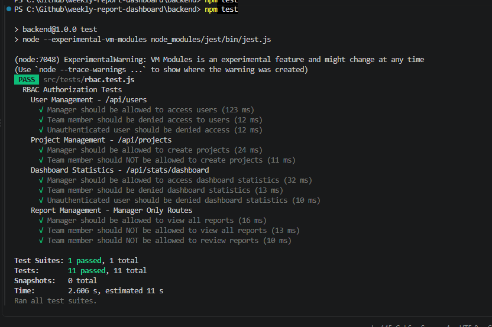

# Weekly Report Generator & Team Dashboard

A full-stack internal tool that lets team members submit structured weekly work reports and gives managers a consolidated dashboard to review, approve, and analyze reports across the whole team.

Built as a technical assignment submission — implements role-based auth, a full submit → correction → resubmit → approve review cycle, project/category management, a data-driven manager dashboard with charts, and CI/CD with automated backend tests.

---

## Tech Stack

| Layer | Technology |
|---|---|
| Frontend | React (component-based, React Router) |
| Backend | Node.js + Express |
| Database | MySQL |
| Charts | Recharts |
| Testing | Jest (backend RBAC / API tests) |
| CI/CD | GitHub Actions |

---

## Git Workflow

- `main` — stable, production-ready branch
- `dev` — active development branch

All feature work was done on `dev`, then merged into `main` via Pull Requests once tested and stable, rather than pushing directly to `main`.

---

## Features

### Authentication & Roles
- User registration, login/logout, password hashing (bcrypt), secure session handling via JWT
- Two roles: **Team Member** and **Manager/Admin**
- Role-based access enforced on the **backend** (middleware), not just hidden in the UI
- Public registration always creates a `team_member` account — a manager account can only be created via the database seed or promoted afterwards by an existing manager on the User Management page. This prevents anyone from self-registering as a manager.

### Personal Weekly Reports (Team Member)
- Fixed, identical report structure for every user (week range, project/category, tasks table, blockers, achievements, hours breakdown, notes)
- Save as draft, edit while in Draft or Needs Correction, submit for review
- Report history page showing all past weeks and their status

### Review & Correction Workflow (Manager)
- Full status lifecycle: `Draft → Submitted → Needs Correction → Submitted → Approved`
- Manager can Approve or Request Changes with a comment
- Team member sees the manager's comment clearly on their report page
- Manager can view/edit only status and comments — never rewrite report content
- Team members can only access their own reports; managers can access all
- Full report version history kept on every resubmission (`report_versions` table), with a comment history (`review_comments`) tied to the exact version it was made against

### Team Dashboard (Manager)
- Filter reports by team member, project/category, date range, and status
- Summary metrics: reports submitted this week, compliance rate, reports needing correction, open blockers
- Charts: tasks completed trend, submission status by team member, workload by project, time spent by task type
- Paginated, filterable reports table

### Projects / Categories
- Full CRUD (add, edit, delete) for projects/categories, managed on a dedicated page

### Pages Implemented (7+ required)
1. Login / Register
2. Personal weekly report (create/edit)
3. Report history (per user)
4. Report detail / view
5. Team member profile (manager view)
6. Project / category management
7. Team dashboard
8. Manager review page

---

## Project Structure

```
weekly-report-dashboard/
├── frontend/
│   ├── public/
│   │   └── auto_tetsing.png   # automated test run screenshot (see below)
│   └── src/
├── backend/
│   ├── src/
│   │   ├── controllers/
│   │   ├── middleware/
│   │   ├── routes/
│   │   └── tests/             # Jest test suites (RBAC, API)
│   ├── schema.sql              # table definitions
│   └── seed_data.sql           # sample users, projects, reports for testing
└── README.md
```

> Adjust the paths above to match your actual folder layout if it differs.

---

## Setup Instructions

### 1. Installing Dependencies

```bash
# Clone the repo
git clone <your-repo-url>
cd weekly-report-dashboard

# Backend
cd backend
npm install

# Frontend
cd ../frontend
npm install
```

### 2. Running the Database (MySQL)

- Create a MySQL database, e.g. `weekly_reports`
- Copy `backend/.env.example` to `backend/.env` and set your DB credentials:

```
DB_HOST=localhost
DB_USER=root
DB_PASSWORD=yourpassword
DB_NAME=weekly_reports
JWT_SECRET=your_jwt_secret
```

- Import the schema, then the seed data (e.g. via phpMyAdmin in XAMPP, or the CLI):

```bash
mysql -u root -p weekly_reports < backend/schema.sql
mysql -u root -p weekly_reports < backend/seed_data.sql
```

The seed data populates a manager and 5 team members, 6 projects, and several weeks of reports across all four statuses (Draft / Submitted / Needs Correction / Approved), so the dashboard is meaningful to review out of the box.

**Test login credentials (all seeded users):**

| Name | Role | Email | Password |
|---|---|---|---|
| ADMIN | Manager | admin@gmail.com | Admin@123 |
| Dulakshi | Team Member | dulakshi@gmail.com | Dulakshi@123 |
| Keshani | Team Member | keshani@gmail.com | Keshani@123 |
| Test test | Team Member | test@gmail.com | Test@123 |
| Tharuki | Team Member | tharu@gmail.com | Tharu@123 |
| Wasana Deu | Team Member | deu@gmail.com | Deu@123 |

### 3. Running the Backend

```bash
cd backend
npm run dev
```

Backend API runs on `http://localhost:5000` (or as configured in `.env`).

### 4. Running the Frontend

```bash
cd frontend
npm run dev
```

Frontend runs on `http://localhost:3000` and talks to the backend API.

---

## Automated Testing

Backend RBAC (role-based access control) and API behavior are covered by an automated Jest test suite, run with:

```bash
cd backend
npm test
```

This covers, among other things:
- Manager vs. team member vs. unauthenticated access to `/api/users`, `/api/projects`, `/api/stats/dashboard`, and report review routes
- That a team member can never view or review another team member's or the whole team's reports

**Test run result:**



All 11 tests across the RBAC suite pass.

---

## CI/CD

This repository uses **GitHub Actions** for continuous integration. On every push / pull request, the pipeline:
1. Installs backend dependencies
2. Runs the automated Jest test suite (`npm test`)
3. (Optionally) builds the frontend to confirm it compiles cleanly

See `.github/workflows/` for the pipeline configuration.

---

## Known Limitations / Not Implemented

- **AI Chat Assistant** — not implemented in this submission.

---

## Future Improvements

- Implement the AI-powered chat assistant for manager Q&A and auto-generated team summaries
- Expand automated test coverage to the frontend and to the full review/correction workflow end-to-end
- Deploy a publicly accessible instance
